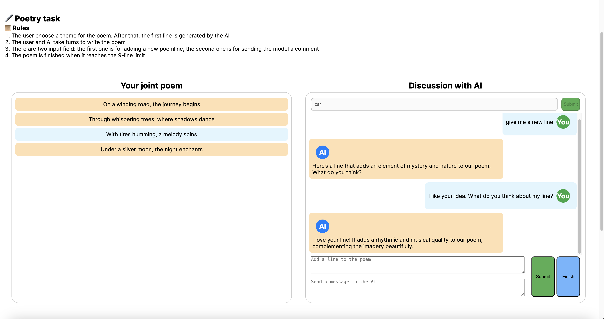

# The ReactJS frontend

In here, you will find the explanation of the task's frontend, all its components and what you should keep in mind while using this as a baseline for creating your own task.

## I. Root component: 
The root component of this frontend is [App.jsx](src/App.jsx) which serves as the entrypoint for the application. 

Inside it are the initial states:
- `messages`: represents the conversation between the user and the model as a list. It is passed down to the child components `Dialogue` and `ConversationDisplay` to be rendered.
- `isFinished`: indicates if the task is finished or not. If it is finished, the `FeedbackForm` will appear.

## II. Child components: 
All the child components are located [here](src/components). Here is a quick run-through of them:

### 1. ConversationDisplay [link](src/components/ConversationDisplay.jsx):
This component represents the Conversation section of the frontend (the part under "Discussion with AI"). It receives the `messages` state from the App component and maps each message to a different `ConversationItem` component.

This is probably the most important component of this frontend functionality-wise since it dictates how the interaction should be. Here is a quick rundown of this component:

- `useEffect()`:
This checks if the length limit is reached or not by using the lengthLimit constant imported from the [config file](src/utils/config.jsx). The check is performed every time the `messages` state changes.

- `parsePoetryAndComment(input)`:
This function processes and parses the output of the model based on square brackets. You can change it based on which output form of the model you want to have. Currently, it works based on how the output of the model is set, which is to have the generated poem line wrapped inside a square bracket.

- `checkAndAddMessage(sender, text, comment, type)`:
This function serves as a way to validate a message before it is added to the `messages` state.

- `handleSubmit`:
This function handles the submission of a user's message.

- `chooseTheme`:
This function sets the theme/objective for the task, which is then sent to the prompt.

- `toggleFinishButton`:
This function handles the interaction of the Finish button. If the button is clicked, it sets the `isFinished` state of the App component to true and the `FeedbackForm` component will appear as the result.
### 2. ConversationItem [link](src/components/ConversationItem.jsx):
This component represents a comment entry, passed down from the `ConversationDisplay` component

### 3. Dialogue [link](src/components/Dialogue.jsx):
This component represents the Dialogue section of the frontend (the part under "Your joint poem"). 
It receives the `messages` state from the App component and maps each message to a different `DialogueItem` component. 

**Note**: the `style` variable inside the component decides the type of the dialogue, which is the `dialogueType` imported from the [config file](src/utils/config.jsx).

### 4. DialogueItem [link](src/components/DialogueItem.jsx):
This component represents a single Dialogue entry. Each dialogue line can be clicked to open its own edit form, which gives the user the ability to modify the dialogue.

### 5. FeedbackForm [link](src/components/FeedbackForm.jsx):
This component represents the feedback form, which appears When the `Finish` button is clicked. When the rating is submitted, it calls the `finishTask` function inside the file [task.js](src/services/task.js), which, at the moment only, logs the rating into the console.

### 6. Footer [link](src/components/Footer.jsx):
This component serves as the Footer for this web application. Modify the content as you see fit.

### 7. Header [link](src/components/Header.jsx):
This component serves as the Header for this web application. Modify the content as you see fit.

### 8. TaskDescription [link](src/components/TaskDescription.jsx):
This component serves as a description of your task. You can change it to tell the user how to use it step-by-step.

## III. API calls:
The API call function `submitUserInput` is located in the file [task.js](src/services/task.js). It receives the user's message as the parameter, sends it to the model through a post request to the `/api/v1/task/process` endpoint, and returns the model's response.

## IV. Config file:
In the config file [config.jsx](src/utils/config.jsx), there are two constants that you need to change based on what your task needs:

- `lengthLimit`: 
This is the length limit of the final generated text. When this limit is reached, the task is deemed finished.

- `dialogueType`: 
You can change its value between `"poem"` and `"paragraph"`. The browser will change how it renders the text based on this value.
